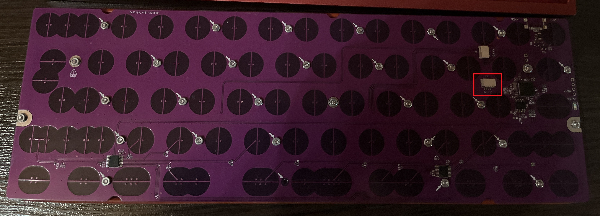
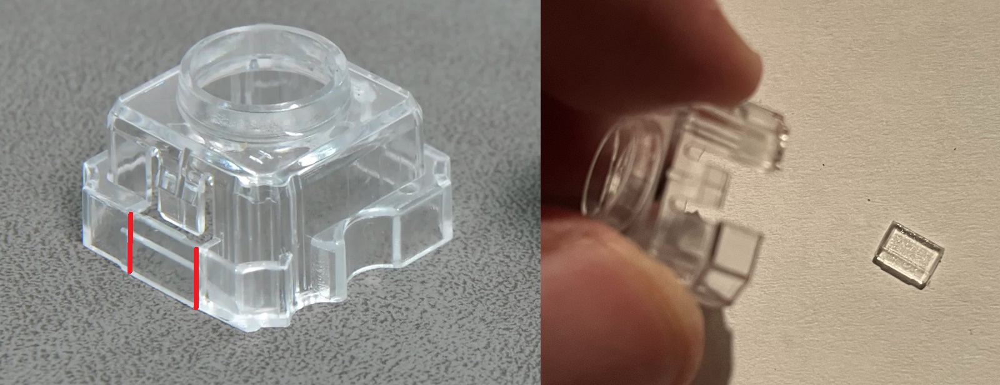
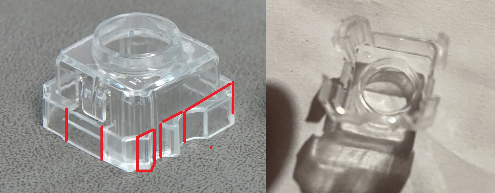
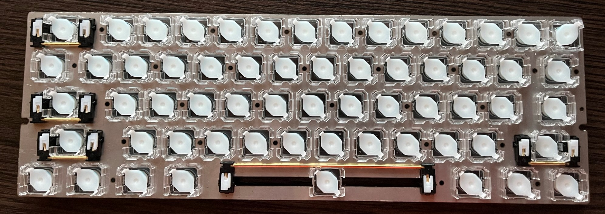
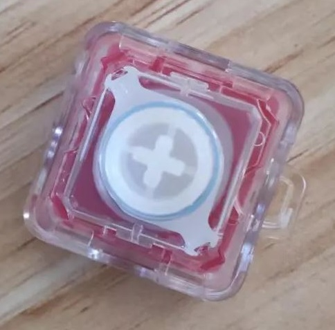

# [Build Log] 60% oring mounted electro capacitive keyboard
**TLDR:** used EC60 pcb and NIZ switches and put inside bakeneko 60 case

Last year (2023) I discover open source ec 60% pcb - EC60 and decided to build my own ec keyboard from scratch. During build process I realised, there is opportunity to add oring and fit EC60 pcb into bakeneko 60 case. In my build I used NIZ switches due to their availability and low cost. After 6 months of use I am more than happy with it. Because accommodate EC60 into bakeneko 60 case is not straightforward I decided to share my build log and turn into guide.

## Parts list:
* 1x EC60 pcb
* 1x C3 daughterboard
* 1x steel plate
* 61x NIZ housings
* 61x NIZ sliders
* 61x NIZ conical springs
* 1x NIZ silicone dome sheet
* C3 plate mounted stabilizers (4x 2u, 1x 6.25u)
* 1x 30A Oring
* 30x M2 12mm long screws
* 30x M2 nuts
* 1x bakeneko 60 case (only [open source](https://github.com/kkatano/bakeneko-60) design case supported) 
* 1x keycaps set

## Tools list:
* 1x plastic nippers
* 1x scissors
* 1x lube (Krytox GPL 205 Grade 0)
* 1x ultra thin brush
* 1x marker

## Sourcing
#### PCB
I used EC60 pcb. Its open source pcb designed by Cipulot and published on [github](https://github.com/Cipulot/EC60). Due to poor availability I bought mine on taobao which (at that time) supports more layouts like ANSI. It supports VIAL only but it not bothers me. Pcb appears in system as M0110_D.
#### Plate
I decided to use 1.6mm stainless steel plate for tight fit NIZ switches. Plate files are available at EC60 github repo but I made a few changes. I want ANSI layout and cherry plate mount switches. For layout preparation I used [http://www.keyboard-layout-editor.com/](http://www.keyboard-layout-editor.com/) and [http://builder.swillkb.com/](http://builder.swillkb.com/) where I exported dxf to CAD and edit plate file. I noticed that number of screw holes between plate styles are different so I combine into one. I also changed holes diameter to support M2 screws. Using NIZ switches you should bear in mind that plate holes should be 14.0 x 14.0 mm unlike for Topre.
#### Switches
I used Niz switches due to availability and my own experience with it. I bought them on taobao with sliders and springs (all from NIZ). For domes I used Niz 45g 108 sheet bought from their website. It was cheapper than on taobao and mail to Poland/EU was't taxed.
#### Stabilizers
On my first attempt I used costars but It was a mistake. My gmk stabilized keycaps stuck when depressed due to its thickness. During my rebuild I decided to use Everglide Panda plate mounted stabs. This require some housings mods for details please see Assembly section.
#### Case
I used custom pc case based on bakeneko 60 open source design. EC60 pcb will fit also in ciel 60. Cannonkeys bakeneko60 is not compatible with EC60 pcb.

## Assembly
### Pcb
Using hot air I removed extra jst connector and usb c. After that pcb can fit into bakeneko case perfectly.\

### Housings
First step is to snap housings into plate. Using NIZ housings proper orientation is to align clips horizontaly. Some housings will clash with nuts. In this case using plastics nippers, in 2 straight cuts I removed excess material on housings bottom, below hook.\

For stabilizer keys I removed same housings part from both sides and also remove all bottom which clash with stabilizer wire. I recommend to start with three vertical cuts and two horizontal after. This procedure reduce crack risk. Last step is to remove excess material from corner.\

To fit oring between pcb and plate you I needed to make room for it. Following idea for stabilizer keys I removed bottom housing piece for top and bottom row.
Prepare housing for Esc key is most difficult. During my mod I destroy one piece. For Esc key housing orientation is different. All stress from the oring is accumulated at the corners so housing must be oriented 90 clockwise than usual. In first step lay housing in place and using marker draw line on outer faces to mark parts to remove. Next step by step like for other housings I removed excess material. As you can see on the bottom removing material from both sides were required.

### Housings and sliders lubing
I used Krytox GPL205g0. Using thin brush I lube each slider leg and housings rails.
### Stabilizers
Stabs has been lubed as well with Krytox and snap in place.
### Sliders
Not all 4 internal housings corners looks the same. 2 of them are straight and short and rest 2 are longer and has convex curve. Slider should be put where corners has curves. When pressed slider has less wobble and small bits on cross stem will be on horizontal cross legs and will follow cherry specs where horizontal stem hole are a bit thicker.\

To avoid sliders popup from housing I lifted plate slightly on the sides on duct tape rolls.
### Dome sheet
I bought 108 key dome. Using scissors I cut sheet to 60% keyboard size. Both dome sheet and my keyboard were in ansi so no additional mod required.
### Springs
I left springs stock. Not lubed just double check if they are sit correctly inside dome.
### Screw all together
I used M2 12mm screws and M2 nuts. 30pcs screw and nuts to hold plate and pcb together. I decided to put screw on sides as well this and may be beneficial for those who use stepped caps lock or split rshift. I didnt put screw under spacebar. In this place there is wide gap in plate for stabilizer wire but possible for different stabilizer type like for topre. 12mm screws are 
### Oring
I used 30A oring, same used in ciel 60. I tried OD185x3.5mm 60A (red) from aliexpress but it gives too much stress to Esc key and I wont be able bo press it.
### Daughterboard
C3 daughterboard used. Plug to usb and put pcb into case. All fits alright. 

